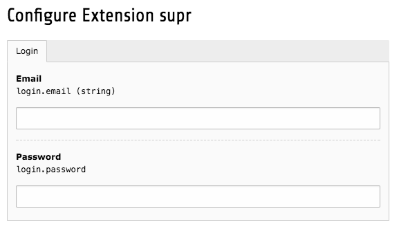

.. ==================================================
.. FOR YOUR INFORMATION
.. --------------------------------------------------
.. -*- coding: utf-8 -*- with BOM.

.. include:: ../Includes.txt

.. _admin-manual:

Administrator Manual
====================

Installation
------------

The extension may be installed by using the Extension Manager in the TYPO3 backend:

#. Head to the TYPO3 backend module "Extension Manager"

#. Get the extension

   #. **Get it by the extension manager:** Select "Get Extensions" from the top and search for *supr*. Afterwards, click the button "Import and Install"

   #. **Get it from typo3.org:** You can always get current version from `http://typo3.org/extensions/repository/view/supr/current/ <http://typo3.org/extensions/repository/view/supr/current/>`_ by downloading either the t3x or zip version. Upload the file afterwards in the Extension Manager.

Configuration
-------------

After installation, you have to configure the extension. Switch to the Extension Manager and click on the extension name.

Login
^^^^^

Enter the credentials of your account from the SUPR management tool. With these credentials, the extension will authenticate with the API by SUPR and fetch all configured widgets.

