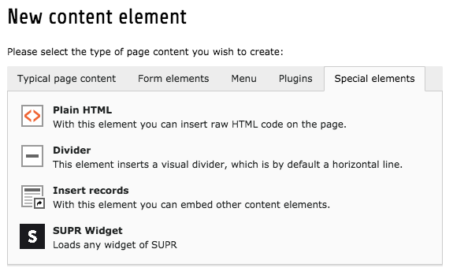
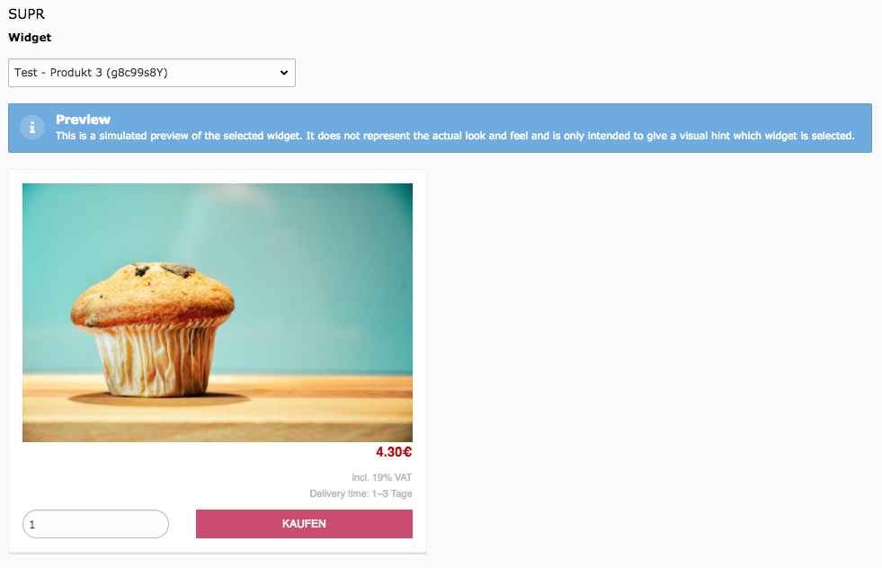

.. ==================================================
.. FOR YOUR INFORMATION
.. --------------------------------------------------
.. -*- coding: utf-8 -*- with BOM.

.. include:: ../Includes.txt

.. _user-manual:

User Manual
===========

Insert the widget
-----------------

Open the "Page" module and head to the desired page in the page tree. Create a new content element at the position the widget should appear.
In the wizard, head to "Special elements" and select "SUPR Widget".

Configure the content element
-----------------------------

In the palette called "SUPR" a field labelled as "Widget" is available. This field contains any widget that is managed in the configured SUPR account.
By selecting a widget, a preview of the selection gets rendered.

.. note::

   This is a simulated preview of the selected widget. It does not represent the actual look and feel and is only intended to give a visual hint which widget is selected.

